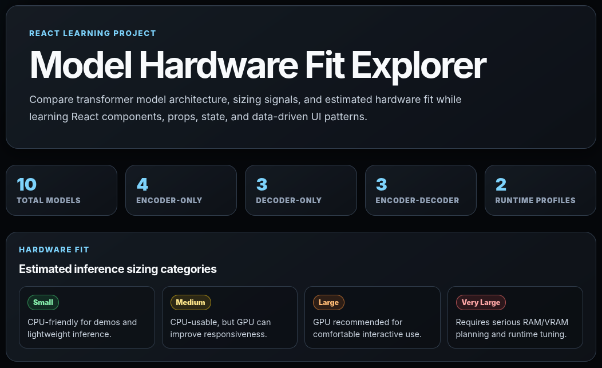
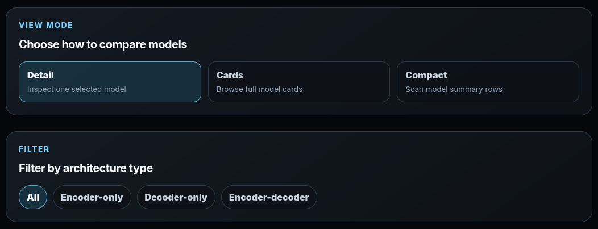
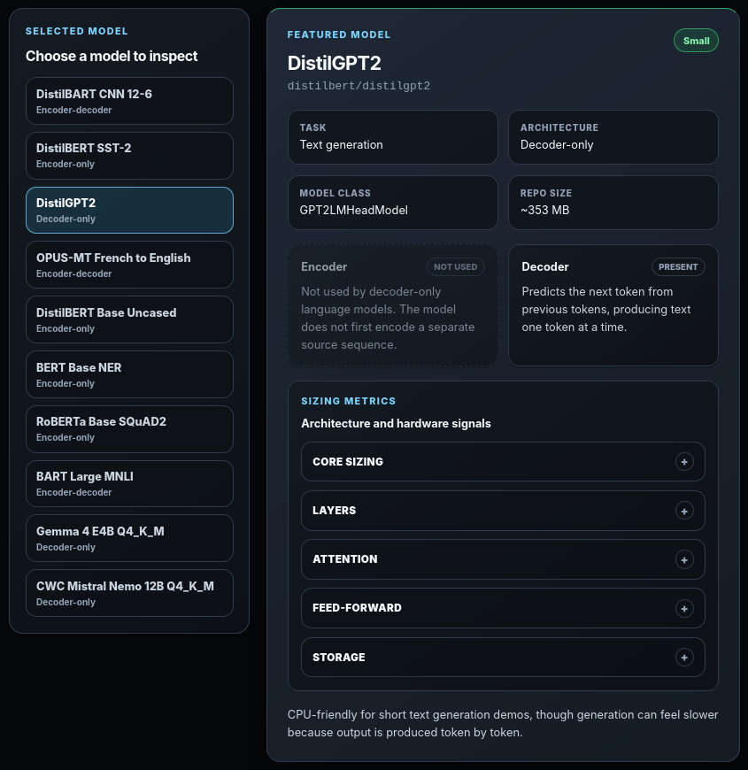
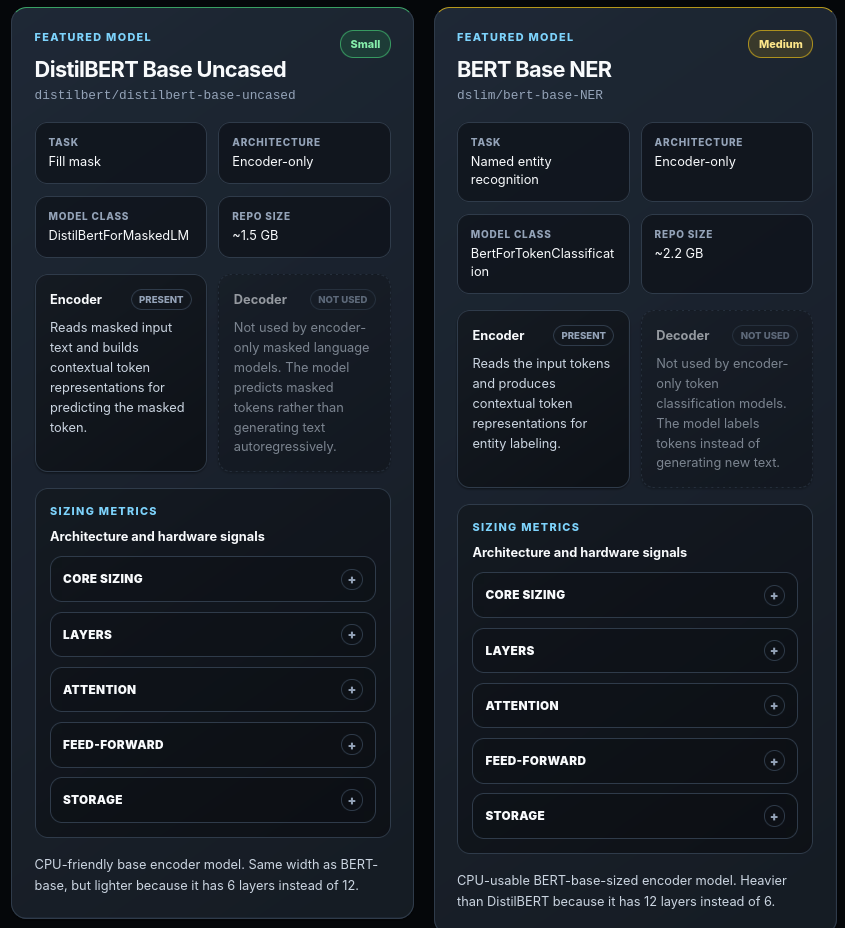
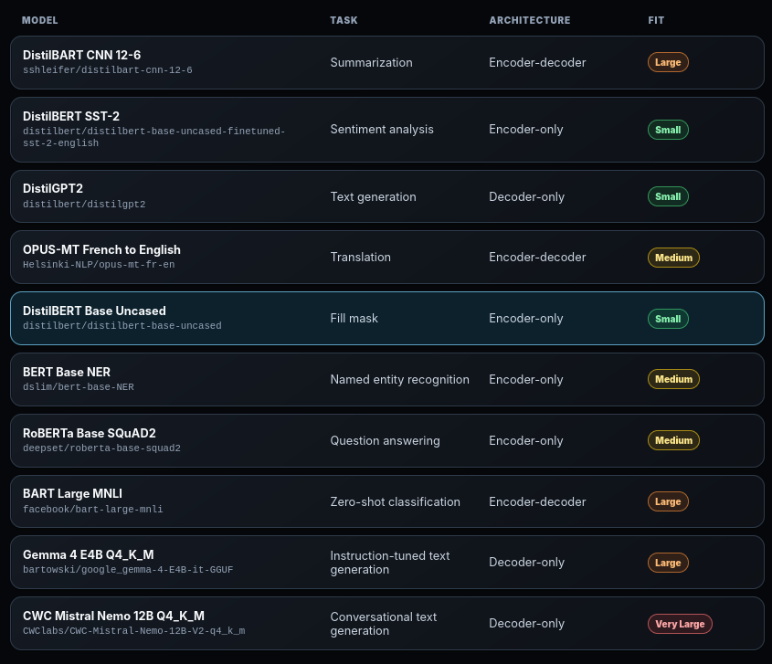
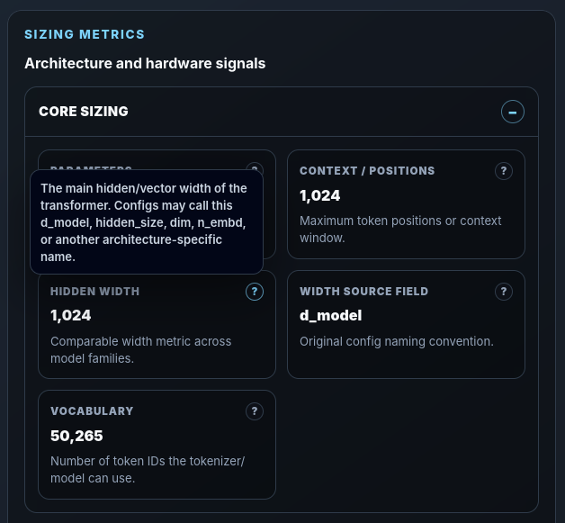
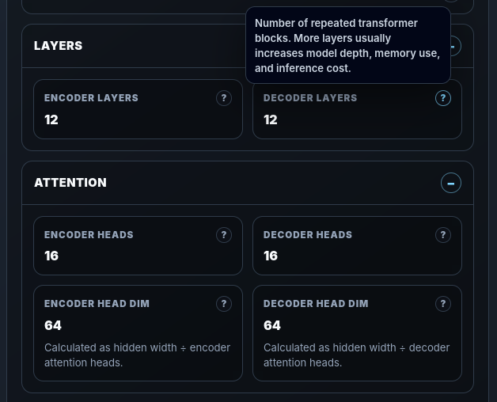
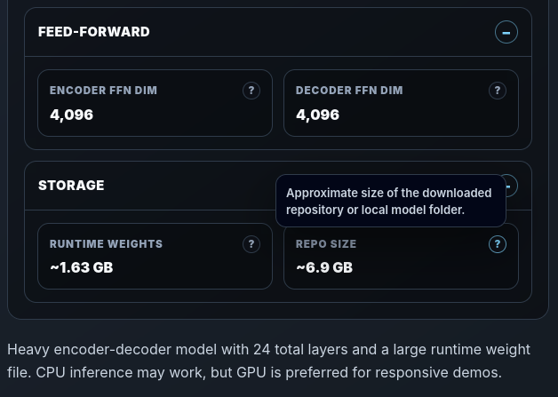

# Model Hardware Fit Explorer

A standalone React learning project for comparing Hugging Face Transformer models and GGUF local LLMs.

The app is designed to teach React fundamentals while helping viewers understand model architecture, sizing signals, and approximate inference hardware fit.

## Screenshots

### Header and hardware fit legend

The landing section introduces the project, summarizes the model inventory, and explains the hardware fit categories used throughout the dashboard.

### View mode and architecture filter controls

Users can switch between Detail, Cards, and Compact views, then filter models by architecture type.

### Detail view

The master-detail layout lets users select one model and inspect its architecture, runtime profile, encoder/decoder structure, and hardware-fit summary.

### Cards view

The responsive card grid provides a visual overview of all included Transformer and GGUF model profiles.

### Compact view

The compact layout makes it easier to scan model name, task, architecture, and hardware-fit category in a table-like format.

### Sizing metrics: core sizing

The sizing metrics panel exposes lower-level model details such as parameter count, context length, hidden width, source config field, and vocabulary size.

### Sizing metrics: layers, attention, and tooltip help

Accordion sections organize deeper architecture metrics, while tooltip help explains concepts like attention heads and head dimensions.

### Sizing metrics: feed-forward, storage, and fit summary

Additional sections show feed-forward dimensions, runtime weight size, repository size, and the model-specific hardware-fit summary.

## Current features

- Manual React + Vite project setup
- High-contrast dark theme
- Responsive card grid
- Master-detail model selection layout
- View toggle:
  - Detail
  - Cards
  - Compact
- Architecture filter
- Hardware fit legend
- Model inventory summary
- Encoder / decoder architecture panels
- Optional GGUF runtime panels
- Sizing metrics accordion
- Metric help tooltips
- Hidden width source-field tracking, such as:
  - d_model
  - hidden_size
  - dim
  - n_embd

## Model types included

- Encoder-only models
- Decoder-only models
- Encoder-decoder models
- GGUF local LLM profiles

## Hardware fit note

Hardware fit categories are educational estimates based on available metadata such as architecture, model size, runtime weight size, quantization, and context length.

They should not be treated as exact hardware requirements.

## Run locally

Run these commands from the project root:

    npm install
    npm run dev

Open the local URL printed by Vite, usually:

    http://localhost:5173/

## Build

Run:

    npm run build

## Offline rebuild note

This project was built with npm cache preserved under:

    ~/Downloads/node-cache

For a future offline rebuild, use the committed package-lock.json with a populated npm cache:

    npm ci --cache "$HOME/Downloads/node-cache" --offline

## Project goal

This project is both:

1. a React front-end learning exercise
2. a model-sizing dashboard for understanding practical inference hardware planning

## Current checkpoint

v0.1: Static React model hardware fit dashboard

## Possible next steps

- More precise source-data normalization from the uploaded model templates
- Additional filters:
  - hardware fit
  - task
  - runtime format
- Model detail drawer or dedicated detail page
- Comparison table
- Python-assisted parsing of model notes into structured data
